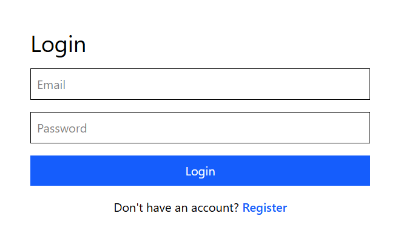
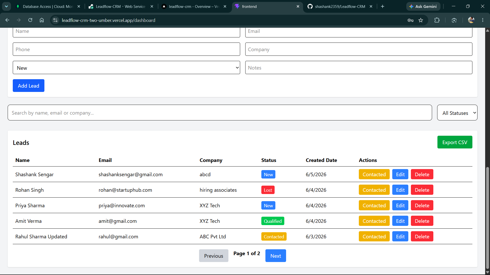
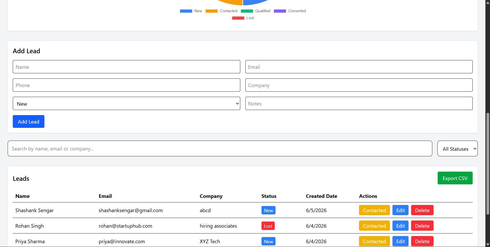
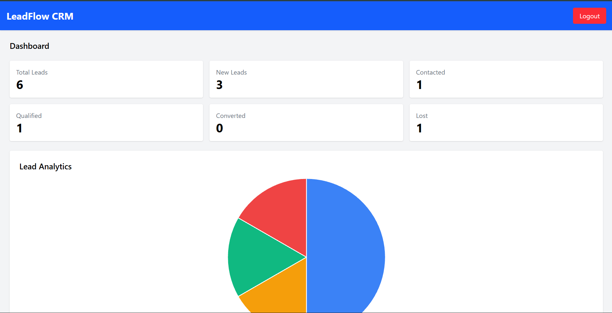

# 🚀 LeadFlow CRM

A full-stack Customer Relationship Management (CRM) application built using React, Node.js, Express, and MongoDB.

## 🌐 Live Demo

Frontend:
https://leadflow-crm-two-umber.vercel.app

Backend:
https://leadflow-crm-ekxa.onrender.com

---

## 📌 Features

### Authentication
- User Registration
- User Login
- JWT Authentication
- Protected Routes
- Logout Functionality

### Lead Management
- Create Leads
- View Leads
- Edit Leads
- Delete Leads
- Lead Status Tracking

### Search & Filter
- Search by Name
- Search by Email
- Search by Company
- Filter by Status

### Dashboard Analytics
- Total Leads
- New Leads
- Contacted Leads
- Qualified Leads
- Converted Leads
- Lost Leads
- Interactive Pie Chart

### Additional Features
- Pagination
- CSV Export
- Responsive Design
- Cloud Deployment

---

## 🛠 Tech Stack

### Frontend
- React.js
- React Router DOM
- Axios
- Tailwind CSS
- Chart.js
- React ChartJS 2

### Backend
- Node.js
- Express.js
- JWT Authentication
- Bcrypt.js

### Database
- MongoDB Atlas
- Mongoose

### Deployment
- Vercel (Frontend)
- Render (Backend)

---

## 📂 Project Structure

```bash
Leadflow-CRM
│
├── frontend
│   ├── src
│   │   ├── pages
│   │   ├── services
│   │   └── components
│   │
│   └── public
│
├── backend
│   ├── controllers
│   ├── middleware
│   ├── models
│   ├── routes
│   └── config
│
└── README.md
```

---

## ⚙️ Installation

### Clone Repository

```bash
git clone https://github.com/shashank2359/Leadflow-CRM.git
```

### Frontend

```bash
cd frontend
npm install
npm run dev
```

### Backend

```bash
cd backend
npm install
npm run dev
```

---

## 🔑 Environment Variables

Create a `.env` file inside backend:

```env
PORT=5000
MONGO_URI=your_mongodb_uri
JWT_SECRET=your_secret_key
```

---

## 📈 Future Improvements

- Dark Mode
- Role Based Access
- Email Notifications
- Activity Logs
- Kanban Lead Board
- Lead Notes Timeline

---

## 👨‍💻 Author

Shashank Singh Sengar

GitHub:
https://github.com/shashank2359

LinkedIn:
https://www.linkedin.com/in/shashanksengar/

---

⭐ If you found this project useful, consider giving it a star.





